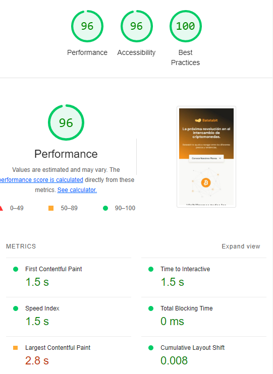
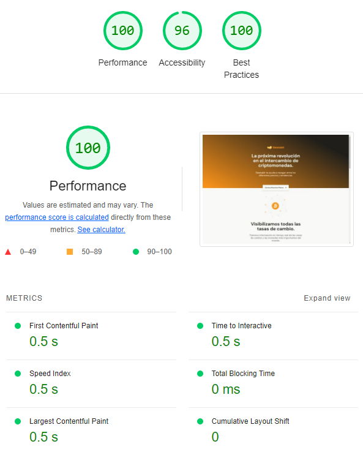

# Landing page Bata bit

Este proyecto es solo maquetacion aplicando mobile first está basado en el [Curso de Responsive Design: Maquetación Mobile First - Platzi](https://platzi.com/cursos/mobile-first/).

El diseño del proyecto es público elaborado en Figma, por lo que comparto el enlace en [mobile](https://www.figma.com/proto/sMmlQaZldfDcLERYYWe6h4/Bata-Bit?node-id=44%3A594&scaling=scale-down) y en otros [breakpoints](https://www.figma.com/file/sMmlQaZldfDcLERYYWe6h4/Bata-Bit?node-id=359%3A154)

Aplique conocimientos de: 
- Nomenclatura BEM
- Flexbox
- Grid
- HTML5
- CSS3
- JS

## Analisis con Lighthouse

- Mobile

- Desktop
